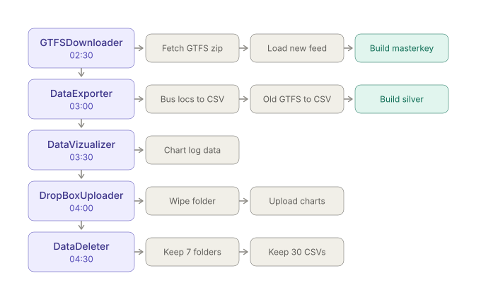

# BramptonTransitAnalysis

*Work in progress.*

A long-running Python pipeline that collects real-time and static GTFS data from Brampton Transit, stores it in SQLite, and produces cleaned daily datasets and diagnostic charts. Built to run unattended for weeks at a time on modest hardware, with no external database server and no orchestration layer.

---

## What it does

Six daemon threads run independently off a shared `stop_event`:

| Thread | Schedule | Responsibility |
|---|---|---|
| `DataCollector` | Every 15 seconds | Polls the GTFS-RT feed, deduplicates against a rolling 5-minute UID cache, inserts new vehicle positions |
| `GTFSDownloader` | 02:30 daily | Downloads the static GTFS zip, loads any new `feed_version`, rebuilds the route masterkey |
| `DataExporter` | 03:00 daily | Exports raw bus locations to CSV, archives superseded GTFS rows, transforms bronze into silver |
| `DataVizualizer` | 03:30 daily | Charts the previous day's collection volume and outages from the log database |
| `DropBoxUploader` | 04:00 daily | Clears the Dropbox app folder and uploads the newest graphics |
| `DataDeleter` | 04:30 daily | Prunes old graphics folders and raw CSV exports |

Ordering is deliberate. `GTFSDownloader` runs before `DataExporter` so the nightly transform joins against a route masterkey built from the current feed rather than the previous day's.

All six threads write structured logs to a separate `LogStorage.db`, so diagnostics never contend with the collection database for locks.

---

## Architecture



### Nightly sequence



---

## Data layers

**Bronze** — `4_Storage/BUS_LOC_DB/BUS_LOC_DB_<timestamp>.csv`

A verbatim dump of the collection table, written nightly. Once the export succeeds the table is emptied and the database vacuumed, keeping the working database small enough to stay fast on slow storage.

**Silver** — `4_Storage/CLEANED_LOC_DATA/<YYYYMMDD>_CLND_BUSLOC.csv`

The previous day's observations, validated, deduplicated, joined to stop sequences and enriched. The transform runs in six phases:

1. Concatenate the three most recent bronze exports and filter to the target date
2. Drop internal columns, rename to analysis-friendly names, round coordinates to five decimals
3. Validate — speed 0–120 km/h, bearing 0–360°, latitude 43.5–44.0, longitude −80.0 to −79.4
4. Deduplicate on vehicle, trip, position, status and stop, then join the route masterkey
5. Enrich — haversine distance to next stop, hour of day, day of week, weekend flag, observations per batch timestamp
6. Write the reordered output CSV

Row counts are logged at every phase, so any data loss is traceable after the fact rather than silent.

---

## Concurrency

Both databases run in WAL mode with a busy timeout, so the 15-second collector keeps writing while the nightly jobs read. Operations that must be atomic take an explicit `BEGIN IMMEDIATE` and roll back per exception type rather than behind a bare `except`.

The dedup cache (`U_ID_TEMP`) is rebuilt in pandas but written with `executemany`, which keeps pandas outside the transaction boundary — `to_sql` opens its own connection and will deadlock against a held write lock.

Shutdown is cooperative. `Ctrl+C` sets `stop_event`, every thread wakes from its `wait()` instead of sleeping through it, and the main thread joins each with a 30-second timeout.

---

## Requirements

Python 3.9+

Core dependencies:

```
requests
pandas
numpy
```

Optional — the pipeline runs without these and logs a warning instead of crashing:

```
matplotlib     # DataVizualizer
dropbox        # DropBoxUploader
```

```bash
pip install requests pandas numpy matplotlib dropbox
```

No database server required. Everything runs on SQLite.

---

## Setup

```bash
git clone https://github.com/renacin/BramptonTransitAnalysis.git
cd BramptonTransitAnalysis
python main.py
```

The pipeline creates its own working directories under the user's Downloads folder on first run:

```
~/Downloads/BramptonTransitAnalysis/
├── 3_Data/
│   ├── DataStorage.db          collection + GTFS tables
│   └── LogStorage.db           structured logs
└── 4_Storage/
    ├── BUS_LOC_DB/             bronze exports
    ├── CLEANED_LOC_DATA/       silver exports
    ├── ROUTES_MASTERKEY/       precomputed stop sequences per feed version
    ├── GRAPHICS/               daily charts, one folder per date
    ├── GTFS/                   working folder for the static feed
    └── FEED_INFO/ ROUTES/ TRIPS/ STOPS/ STOP_TIMES/ ROUTE_SPEED/
                                archives of superseded GTFS rows
```

On first run the pipeline creates all directories, downloads the current static feed, computes trip-level speed estimates, and begins collecting.

Dropbox upload is optional. To enable it, point `drpbx_keys` in `env_config.py` at a CSV with `Name,Value` rows for `Appkey`, `Appsecret` and `RefreshToken`.

---

## Databases

**DataStorage.db**

| Table | Contents |
|---|---|
| `BUS_LOC_DB` | Raw vehicle positions from the realtime feed |
| `U_ID_TEMP` | Rolling 5-minute cache of seen UIDs, used for the dedup anti-join |
| `FEED_INFO` | Feed publisher and version metadata |
| `ROUTES` | Route IDs and names |
| `TRIPS` | Trip IDs, headsigns, directions, blocks, shapes |
| `STOPS` | Stop IDs, names, coordinates |
| `STOP_TIMES` | Scheduled arrival and departure per trip and stop |
| `ROUTE_SPEED` | Derived per-trip distance, idle time, travel time, average speeds |

Every GTFS table carries a `feed_version` column, which is how superseded rows are identified and archived.

**LogStorage.db**

A single `DB_LOGS` table — timestamp, reporter, warning level, message. Levels are `1` INFO, `2` WARNING, `3` ERROR, `4` CRITICAL. `DataVizualizer` reads this table to build the nightly chart.

---

## Project structure

```
BramptonTransitAnalysis/
├── main.py                    Entry point, thread definitions, scheduler logic
└── Functions/
    ├── env_config.py          All configuration — URLs, paths, table schemas
    ├── env_setup.py           First-run setup and route speed computation
    ├── data_collect.py        Collector — GTFS-RT polling and dedup
    ├── gtfs_downloader.py     GTFS_Downloader — static feed fetch, load, masterkey
    ├── data_exporter.py       Exporter — CSV export and bronze to silver transform
    ├── data_visualiser.py     Visualizer — nightly log chart
    ├── upld_dropbox.py        DropBoxUploader — graphics mirror
    ├── data_deleter.py        Deleter — retention policy
    └── data_helper.py         Shared utilities — haversine, logger, stop ID normaliser
```

---

## Configuration

All runtime settings live in `Functions/env_config.py`:

| Setting | Default | Description |
|---|---|---|
| `BUS_LOC_URL` | Brampton Transit GTFS-RT endpoint | Live vehicle position feed |
| `GTFS_URL` | ArcGIS item data URL | Static GTFS zip download |
| `cache_time_limit` | `5` minutes | How long UIDs stay in the dedup cache |
| `timeout_time` | `10` seconds | Request timeout, also the backoff on an empty response |
| `drpbx_keys` | Local CSV path | Dropbox app key, secret and refresh token |

Retention limits live with the code that enforces them, in `data_deleter.py` — 7 graphics folders and 30 raw exports.

---

## Roadmap

- **Tests.** There is no automated coverage yet. The transform phases and the dedup logic are the highest-value targets.
- **Dependency manifest.** A `requirements.txt` or `pyproject.toml` so the project is reproducible from a clone.
- **Export filenames.** Bronze exports use `DD-MM-YYYY`, which does not sort chronologically. Moving to `YYYYMMDD` would let directory listings sort correctly without depending on file modification times, which do not survive a copy or restore.
- **Credentials.** The Dropbox key path is a hardcoded absolute path in `env_config.py`. It belongs in an environment variable.
- **Distance measure.** `hvrsn_dist` returns straight-line distance. Road-network distance would give meaningfully better speed and arrival estimates.
